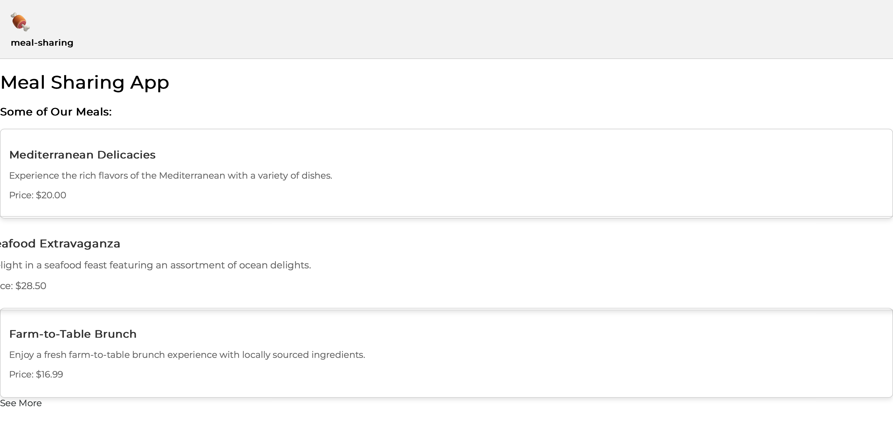

# Meal Sharing App

# Make a Reservarion & leave a Review

## ➡️  [Link to the App](https://meal-sharing-n0q9.onrender.com)

# Description

This is a full-stack web application built with Express.js, React, and PostgreSQL.

It was created as an individual project task for Hack Your Future Denmark's curriculum.

The app was deploy in Render

The main functionalities of this website are:

- Displaying the meals in the database
- Searching for a meal
- Making a reservation
- Leaving a review

# Technologies Used

- Express.js
- KnexJS
- PostgreSQL
- React
- CSS Modules
